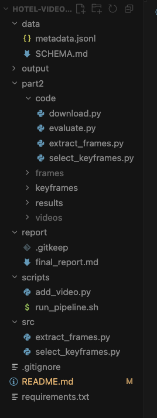

# Hotel Video Collection and Keyframe Extraction

## What this project does 

This repository contains a curated 50-video hotel-room metadata dataset and a Part 2 keyframe-selection pipeline for five selected videos.

The project has two goals:
1. collect and organize public hotel-room video metadata from messy real-world sources.
2.reduce selected videos into representative keyframes for downstream hotel scene understanding.

## Draft of Dataset Structure
